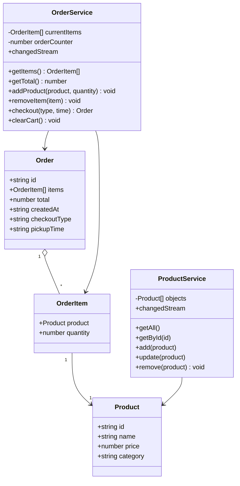
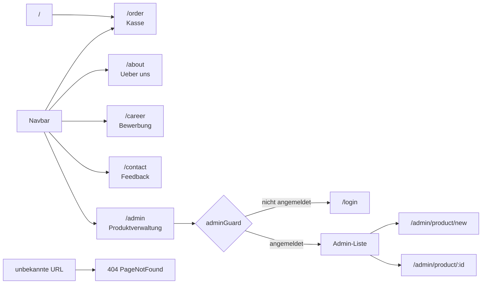
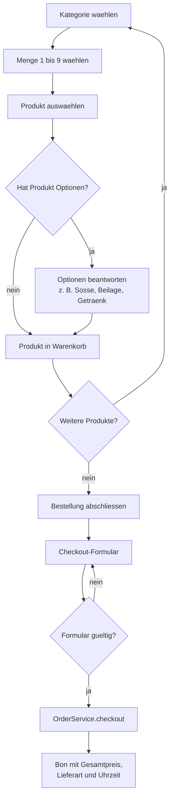
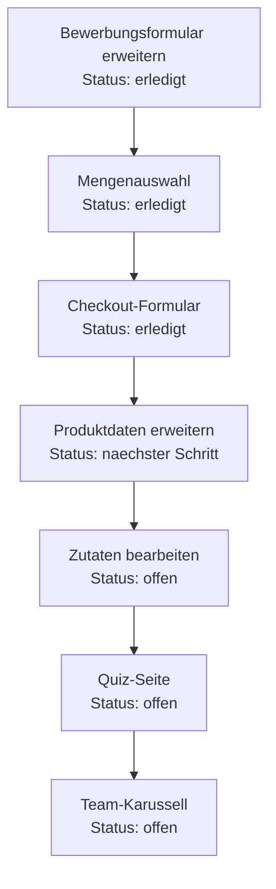

# McDenisa Wiki

Dieses Dokument sammelt, was im Angular/WebFrontends-Projekt schon umgesetzt wurde und was noch offen ist. Orientierung: nur das Kursbuch `docs/webfrontends-buch.pdf` und die Projektregeln aus `docs/projekt-vorgaben.md`.

## Schon gemacht

- Angular-Projekt mit Standalone-Components aufgebaut.
- Routing eingerichtet:
  - `/order`
  - `/about`
  - `/career`
  - `/contact`
  - `/login`
  - `/admin`
  - `/admin/product/new`
  - `/admin/product/:id`
  - Wildcard-Route fuer 404-Seite.
- Navbar mit `routerLink` und `routerLinkActive`.
- Kassenseite mit Kategorien, Produktauswahl, Optionen und Warenkorb.
- Kassenseite mit Mengenauswahl 1 bis 9.
- Checkout-Formular mit Abholen/Liefern und Uhrzeit.
- Produktmodell in `src/app/model/product.ts`.
- Bestellmodell in `src/app/model/order.ts`.
- Bestellposition in `src/app/model/order-item.ts`.
- Services in `src/app/shared/`:
  - `ProductService`
  - `OrderService`
- Produktverwaltung im Admin-Bereich:
  - Produkte anzeigen
  - Produkte anlegen
  - Produkte bearbeiten
  - Produkte loeschen
- Login-Schutz fuer Admin-Bereich mit `adminGuard`.
- Reactive Forms bei:
  - Produktformular
  - Login
  - Kontaktformular
  - Bewerbungsformular
- Kontaktformular mit Bewertung.
- Bewerbungsformular mit Validierung.
- Bewerbungsformular mit Bereichsauswahl und Verfuegbarkeitsdatum.
- Buchreferenz im Projekt abgelegt: `docs/webfrontends-buch.pdf`.
- Code-Anpassungen an Buchregeln:
  - Constructor-Injection mit `public`
  - Produktliste nutzt `ProductService`
  - fehlender `RouterLink` in 404-Komponente ergaenzt
  - Debug-Ausgabe aus Kontaktformular entfernt
  - App-Test an aktuelle Navbar angepasst

## Diagramme

### UML-Klassendiagramm

### Routing-Uebersicht

### Bestellablauf

### Arbeitsreihenfolge

## Noch zu tun

### 1. Kategorie "Ueber uns" - Team-Karussell

Status: offen

Ziel:
- Auf der Seite `/about` soll ein Team-Karussell eingebaut werden.
- Darstellung als Coverflow/3D-Karussell:
  - mittlere Team-Karte im Fokus
  - aeussere Karten leicht gekippt
  - Karten koennen gedreht werden

Karte Vorderseite:
- Cartoon-Avatar
- Alias-Name
- Rolle im Store

Karte Rueckseite:
- Station, z. B. "Vom Crew-Member zur Chefin"
- Lieblings-McMenue
- Motto

Daten sammeln:
- Schichtfuehrer nach Fakten fragen:
  - Lieblingsprodukt
  - Superkraft im Store
  - seit wann dabei
- Kein Geburtsdatum sammeln.

Alias-Namen:
- echte Namen nicht direkt anzeigen
- Beispiel:
  - Anastasia Saitinidou -> Anamaria Satanitov

Technischer naechster Schritt:
- JSON-Array mit Teamdaten in der About-Component oder als eigene Datei anlegen.
- HTML/CSS fuer Flip-Karten und Coverflow bauen.

### 2. Neue Kategorie "Spiel"

Status: offen

Ziel:
- Neue Route `/quiz`.
- McDenisa Quiz mit Fragen zu:
  - Produkten
  - Menues
  - Preisen
  - Fun-Facts
- Ergebnis-Seite mit Auswertung, z. B. "Burger-Profi".

Geplante Struktur:
- `/quiz`
- `/quiz-result`
- `question-card`
- `answer-button`
- `score-box`
- `quiz.service.ts`

Formular:
- Vor dem Quiz Name eingeben.
- Validator: Name darf nicht leer sein.

Technischer naechster Schritt:
- Routes ergaenzen.
- QuizService mit Fragen-Array bauen.
- Reactive Form fuer Namenseingabe erstellen.

### 3. Produkte bearbeiten wie in Avalonia

Status: offen

Ziel:
- Beim Klick auf ein Produkt, z. B. Big Mac, soll eine Zutatenliste erscheinen.
- Jede Zutat hat ein Haekchen.
- Haekchen entfernen bedeutet: Zutat wird aus der Bestellung entfernt.

Beispiel:
- Big Mac:
  - Bun
  - Fleisch
  - Kaese
  - Salat
  - Sauce
  - Gurken
  - Zwiebeln

Technischer naechster Schritt:
- Produktdaten um `ingredients` erweitern.
- Auswahl in `Order` speichern.
- Anzeigename im Warenkorb mit entfernten Zutaten erweitern.

### 4. Mengenauswahl

Status: erledigt

Ziel:
- Oben in der Kasse Zahlen 2 bis 9 anzeigen.
- Nutzer waehlt eine Zahl und fuegt ein Produkt direkt mehrfach hinzu.

Umgesetzt:
- `selectedQuantity` in `Order` angelegt.
- Button-Leiste fuer Mengen 1 bis 9 eingebaut.
- `OrderService.addProduct` nimmt jetzt eine Menge entgegen.
- Nach dem Hinzufuegen wird die Menge wieder auf 1 gesetzt.

### 5. Checkout-Formular

Status: erledigt

Ziel:
- Nach Bestellabschluss soll ein Formular erscheinen.
- Auswahl:
  - Liefern
  - Abholen
- Uhrzeit angeben.

Umgesetzt:
- Reactive Form fuer Checkout gebaut.
- Felder:
  - `checkoutType`
  - `pickupTime`
- Bestellmodell um Lieferart und Uhrzeit erweitert.
- Bestellung wird erst abgeschlossen, wenn das Formular gueltig ist.

### 6. Produktdaten erweitern

Status: offen

Ziel:
- Pro Produkt sollen weitere Daten hinterlegt werden:
  - Allergene
  - Kalorien
  - optional weitere Naehrwerte

Technischer naechster Schritt:
- `Product`-Klasse erweitern.
- Produktdaten im `ProductService` ergaenzen.
- Anzeige in Produktdetails oder Admin-Bereich planen.

### 7. Bewerbungsformular erweitern

Status: erledigt

Ziel:
- Bewerbungsformular soll zusaetzliche Angaben bekommen.

Neue Felder:
- Bereich:
  - Kueche
  - vorne
  - egal
- Ab wann verfuegbar.

Umgesetzt:
- `Career`-FormGroup wurde um `availableFrom` erweitert.
- Bereichsauswahl wurde auf Kueche / vorne / egal angepasst.
- Verfuegbarkeitsdatum ist ein Pflichtfeld.

## Empfohlene Reihenfolge

1. Produktdaten erweitern, weil Zutaten, Allergene und Kalorien darauf aufbauen.
2. Zutaten bearbeiten.
3. Quiz-Seite.
4. Team-Karussell, weil Design und Datenaufbereitung am meisten Zeit brauchen.

## Arbeitsreihenfolge mit Status

1. Bewerbungsformular erweitern - erledigt.
2. Mengenauswahl in der Kasse - erledigt.
3. Checkout-Formular - erledigt.
4. Produktdaten erweitern - naechster Schritt.
5. Zutaten bearbeiten - offen.
6. Quiz-Seite - offen.
7. Team-Karussell - offen.

## Pruefung

Aktueller Stand der letzten Pruefung:
- TypeScript-Check: bestanden.
- Unit-Tests: bestanden.
- `npm run build`: bricht aktuell mit Exit-Code 134 ohne Angular-Fehlermeldung ab.
