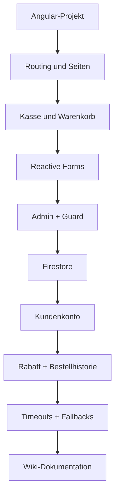

# McDenisa Projekt-Dokumentation

Diese Datei ist die kurze lokale Kopie zur GitHub-Wiki. Die ausführliche Dokumentation steht in der Wiki des Prüfungs-Repositories.

Repository: `https://github.com/denisaandreea-a/McDenisa-Website-Pruefung`

## Projektüberblick

| Punkt | Beschreibung |
|---|---|
| Projekt | McDenisa |
| Art | fiktive Kassen-Webanwendung |
| Modul | Web-Frontends mit Angular |
| Semester | Sommersemester 2026 |
| Framework | Angular mit Standalone Components |
| Datenhaltung | Firebase Firestore |
| Login | Firebase Authentication für Kunden, separater PIN-Login für Admin |
| Ziel | zentrale Angular-Themen in einer zusammenhängenden Anwendung zeigen |

## Wiki-Struktur

| Wiki-Seite | Inhalt |
|---|---|
| Home | Überblick über Projekt und Seiten |
| Prüfungsstand | aktueller Stand der Abgabe |
| Entwicklungsverlauf | wann welche Funktionen umgesetzt wurden |
| Scope | In Scope, Out of Scope, Definition of Done |
| Schon gemacht | technische Umsetzung nach Themen |
| Diagramme | Mermaid-Skizzen zu Architektur und Abläufen |
| Probleme & Lösungen | Probleme, Ursachen und Lösungen |
| Prüfungserklärungen | Lernhilfe für die mündliche Prüfung |
| Pflichtaufgaben | Kursbuch-Themen und Status |
| Noch zu tun | optionale Erweiterungen |

## Hauptfunktionen

| Bereich | Funktionen |
|---|---|
| Kasse | Kategorien, Produkte, Mengen, Optionen, Warenkorb |
| Checkout | Reactive Form, Abholen/Liefern, Liefergebühr, Danke-Fenster |
| Kundenkonto | Registrieren, Einloggen, Ausloggen |
| Rabatt | 10 % Rabatt für eingeloggte Kunden |
| Bestellhistorie | persönliche Bestellungen pro Firebase-`uid` |
| Admin | Produktliste, Produkt anlegen, bearbeiten und löschen |
| Kontakt | Feedbackformular mit sichtbaren Kommentaren |
| Über uns | Teamkarten mit Initialen und Alias |
| Transparenz | Schulprojekt-Hinweis und Musterdaten |

## Technische Themen

| Thema | Umsetzung |
|---|---|
| Components | eigene Seiten und UI-Bausteine |
| Routing | öffentliche Routen, Admin-Routen, Kundenhistorie |
| Guards | `adminGuard` und `customerGuard` |
| Services | Logik und Datenzugriff ausgelagert |
| Models | `Product`, `OrderItem`, `Order` |
| Reactive Forms | Checkout, Kontakt, Karriere, Login, Produktformular |
| Custom Validator | Telefonnummer-Prüfung |
| Firebase | Firestore-Produkte und Kundenbestellungen |
| Authentication | Kundenregistrierung und Login |
| Resilienz | Timeouts und lokale Fallbacks |

## Scope

### In Scope

| Funktion | Status |
|---|---|
| Kasse mit Warenkorb | umgesetzt |
| Produktoptionen | umgesetzt |
| Checkout mit Validierung | umgesetzt |
| Danke-Fenster nach Bestellung | umgesetzt |
| Kundenkonto | umgesetzt |
| 10-%-Rabatt | umgesetzt |
| persönliche Bestellhistorie | umgesetzt |
| Admin-Produktverwaltung | umgesetzt |
| Firestore-Anbindung | umgesetzt |
| Schulprojekt-Hinweis | umgesetzt |
| anonymisierte Team- und Kontaktdaten | umgesetzt |
| Wiki-Dokumentation | umgesetzt |

### Out of Scope

| Nicht enthalten | Grund |
|---|---|
| echte Restaurantbestellung | Projekt ist fiktiv |
| Online-Zahlung | zu groß und sicherheitskritisch für den Semesterumfang |
| echte Rabatte | Rabatt ist nur Demonstration der Logik |
| Social Login | nicht nötig für den Kernumfang |
| Push-Benachrichtigungen | optionales Zusatzthema |
| Produktivbetrieb | Seite ist ausdrücklich ein Schulprojekt |

## Ablaufskizze

## Wichtigste Probleme und Lösungen

| Problem | Lösung |
|---|---|
| Bestellhistorie blieb im Ladezustand | Angular-Signale, Timeout und lokale Sicherung |
| Bestellnummer startete wieder bei 1 | Zähler pro Kundenkonto speichern |
| Registrierung wirkte ohne Reaktion | sichtbare Validierung und Timeout-Meldungen |
| Produkte fehlten bei langsamer Verbindung | lokale Startprodukte als Fallback |
| Feedback-Kommentar war nicht lesbar | CSS-Farbe und Zeilenumbrüche korrigiert |
| Tests sollten nicht gegen echte Firebase laufen | Firebase-Konfiguration über Injection Token |
| Burger-Menü auf dem Handy ließ sich nicht anklicken | Bootstrap-CSS war eingebunden, aber Bootstrap-JS fehlte in `angular.json` → `bootstrap.bundle.min.js` als Script ergänzt |
| Kategorie-Leiste auf dem Handy kaum sichtbar/nutzbar | `.category-slider` und `.cat-card` waren nur für Desktop-Breite gebaut (8 Kacheln mit `flex: 1`) → Media Query ab 700px macht die Leiste horizontal scrollbar und die Kacheln kleiner |

### Prüfungserklärung: Responsive Layout

Das Kassenlayout (`.pos-layout`, `.pos-cart` mit fester Breite `280px`, `.category-slider`) wurde ursprünglich für Desktop gebaut und nicht mit Media Queries abgesichert. Auf dem Handy führte das zu zwei sichtbaren Fehlern:

1. **Burger-Menü tot:** Der Button nutzt Bootstraps `data-bs-toggle="collapse"`. Das ist reines JavaScript-Verhalten – ohne das Bootstrap-JS-Bundle registriert Bootstrap keinen Klick-Handler, der Button sieht nur so aus, als würde er funktionieren.
2. **Kategorien verschwinden:** `.category-slider` ist eine Flexbox-Zeile, in der jede der 8 `.cat-card`-Kacheln `flex: 1` bekommt. Auf schmalen Bildschirmen bleibt für jede Kachel kaum Platz, Bild/Icon/Text (mit `overflow: hidden`) werden unlesbar klein.

Merksatz für die mündliche Prüfung:

> „Ich habe Media Queries benutzt, weil das ursprüngliche POS-Layout für Desktop gebaut war. Auf mobilen Geräten wird die Kategorieauswahl horizontal scrollbar und die Kacheln werden kleiner, statt sich zusammenzuquetschen.“

Optionaler nächster Schritt (noch nicht umgesetzt): `.pos-layout` und `.pos-cart` unter einem Breakpoint auf ein einspaltiges Layout umstellen (Kategorien/Produkte zuerst, Warenkorb darunter oder als kompakter Bereich), statt die feste `280px`-Breite des Warenkorbs beizubehalten.

## Definition of Done

Eine Funktion gilt als fertig, wenn:

1. sie über die Oberfläche erreichbar ist,
2. Eingaben validiert werden,
3. Logik im passenden Service liegt,
4. Daten korrekt gespeichert oder geladen werden,
5. Fehler verständlich angezeigt werden,
6. geschützte Bereiche einen Guard verwenden,
7. TypeScript ohne Fehler kompiliert,
8. relevante Tests erfolgreich laufen,
9. die Funktion in der Wiki erklärt ist.
