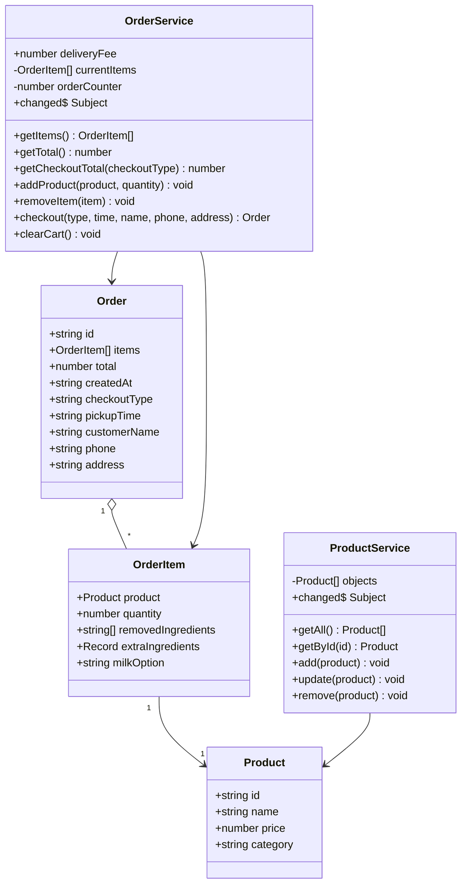
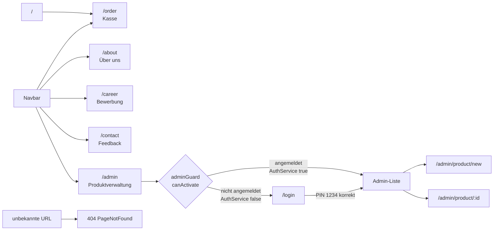
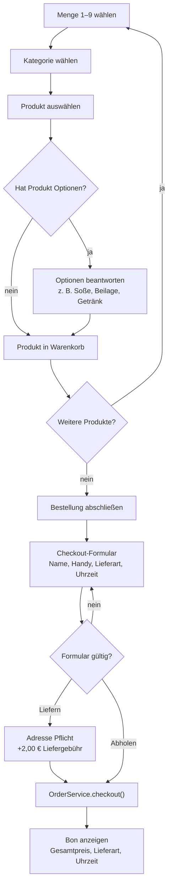
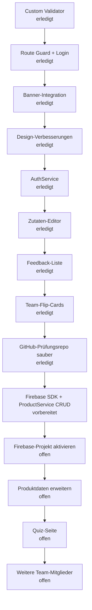

# McDenisa Wiki

Dieses Dokument sammelt, was im Angular/WebFrontends-Projekt umgesetzt wurde, welche Probleme aufgetreten sind und was noch offen ist. Orientierung: Kursbuch `docs/webfrontends-buch.pdf` und Projektregeln `docs/projekt-vorgaben.md`.

---

## Aktueller Prüfungsstand

Stand: 07.07.2026

- Aktuelles Prüfungs-Repository: `https://github.com/denisaandreea-a/McDenisa-Website-Pruefung`
- Das alte Repository `McDenisa-Website` wurde auf privat gestellt.
- Das neue Prüfungs-Repository wurde aus dem bereinigten aktuellen Stand erstellt.
- GitHub zeigt im neuen Prüfungs-Repository nur noch **1 Contributor**: `denisaandreea-a`.
- Alte Claude/Co-Author-Einträge sind im aktuellen Branch nicht mehr enthalten.
- Letzter sauberer Stand vor Firebase: `ad5cb1c Update wiki for exam repository status`.
- Lokaler zusätzlicher Remote:
  - `origin` — altes privates Repository
  - `clean` — neues Prüfungs-Repository

### Git-Bereinigung

Problem:
- Im alten Repository wurde in der GitHub-Seitenleiste noch `claude` als Contributor angezeigt.
- Ursache waren frühere `Co-Authored-By`-Einträge in alten Commits bzw. GitHub-interne Contributor-Daten.

Lösung:
- Aktueller `main` wurde geprüft: keine Treffer für `Claude`, `Anthropic` oder `Co-Authored-By`.
- Lokale Backup-Refs unter `refs/original/...` wurden entfernt.
- Da GitHub die alte Contributor-Seitenleiste trotzdem noch gecacht hatte, wurde ein neues sauberes Prüfungs-Repository angelegt.
- Ergebnis im neuen Repository: Contributors-Anzeige steht auf `1` und enthält nur `denisaandreea-a`.

---

## Schon gemacht

### Grundstruktur

- Angular-Projekt mit Standalone-Components aufgebaut.
- Routing eingerichtet:
  - `/order` — Kassenseite
  - `/about` — Über uns
  - `/career` — Bewerbung
  - `/contact` — Kontakt / Feedback
  - `/login` — Admin-Login
  - `/admin` — Produktverwaltung (geschützt)
  - `/admin/product/new` — Neues Produkt (geschützt)
  - `/admin/product/:id` — Produkt bearbeiten (geschützt)
  - Wildcard-Route für 404-Seite.
- Navbar mit `routerLink` und `routerLinkActive`.
- Navbar ist sticky (`position: sticky; top: 0; z-index: 100`).
- Schriftart: Nunito (Google Fonts), eingebunden in `index.html`.

### Modelle

- `src/app/model/product.ts` — Produktmodell
- `src/app/model/order.ts` — Bestellmodell mit Kundendaten, Lieferart und Uhrzeit
- `src/app/model/order-item.ts` — Bestellposition mit Produkt, Menge, entfernten Zutaten, McCafé-Extras und Milchoption

### Services (Kap. 8.5–8.6)

- `ProductService` (`src/app/shared/product.ts`) — verwaltet alle Produkte, sendet Änderungen über `changed$` als RxJS-Subject.
- `OrderService` (`src/app/shared/order.ts`) — verwaltet Warenkorb und abgeschlossene Bestellungen.
- `AuthService` (`src/app/shared/auth.service.ts`) — kapselt Login-Status (`isLoggedIn()`, `login()`, `logout()`) über `sessionStorage`.

### Firebase / Firestore (Kap. 12)

Dateien:
- `package.json`
- `package-lock.json`
- `src/environments/environment.ts`
- `src/app/shared/product.ts`
- `src/app/admin/admin.ts`

Status: technisch vorbereitet, Aktivierung mit eigenem Firebase-Projekt noch offen.

Umsetzung:
- Das offizielle Firebase SDK (`firebase`) wurde installiert.
- `@angular/fire` wurde nicht installiert, weil die aktuelle Version Peer Dependencies für Angular 20 erwartet, das Projekt aber Angular 22 nutzt. Damit kein instabiler `--force`-Install entsteht, wird Firestore direkt über das Firebase SDK im Angular-Service verwendet.
- Firebase wird im `ProductService` per dynamischem `import()` geladen. Dadurch landet Firestore in einem Lazy Chunk und bläht den initialen Angular-Bundle nicht unnötig auf.
- Die Firebase-Konfiguration liegt in `src/environments/environment.ts`.
- `environment.firebase.enabled` ist aktuell `false`. Dadurch läuft das Projekt weiterhin mit den lokalen Startdaten und bleibt ohne Firebase-Projekt buildbar.
- Wenn `enabled` auf `true` gesetzt wird, verwendet `ProductService` Firestore.
- Collection-Name: `products`.
- CRUD-Methoden im `ProductService`:
  - `getAll()` — liest alle Produkte aus Firestore und sortiert sie nach Kategorie/Name
  - `getById(id)` — liest ein Produkt per Dokument-ID
  - `add(product)` — speichert ein neues Produkt mit `setDoc`
  - `update(product)` — überschreibt ein bestehendes Produkt mit `setDoc`
  - `remove(product)` — löscht ein Produkt mit `deleteDoc`
- Wenn Firestore aktiviert ist und die Collection leer ist, schreibt `seedDefaultProducts()` die vorhandenen McDenisa-Startprodukte einmalig in Firestore.
- Components bleiben bewusst schlank: Admin, Produktformular und Bestellseite rufen weiterhin nur den `ProductService` auf. Der Datenbankzugriff ist im Service gekapselt, wie im Buch bei Services/Dependency Injection vorgesehen.

Aktivierungsschritte:
1. Firebase-Projekt in der Firebase Console erstellen.
2. Web-App im Firebase-Projekt registrieren.
3. Firestore Database anlegen.
4. Web-App-Konfiguration in `src/environments/environment.ts` eintragen.
5. `enabled: true` setzen.
6. App starten und im Admin-Bereich prüfen, ob Produkte aus Firestore geladen werden.

Beispielstruktur in Firestore:

```text
products
  b1
    name: "Big Mac"
    price: 5.49
    category: "Burger"
```

### Kassenseite

- Kategorien mit Bildern (Menüs, Happy Meal, Burger, Chicken, Beilagen, Getränke, McCafé, Desserts).
- Mengenauswahl 1 bis 9 vor dem Hinzufügen.
- Akkordeon-Dialog: Produkt wählen → Optionen beantworten (z. B. Soße, Getränk, Größe).
- Warenkorb links: Artikel, Menge, Preis, Entfernen-Button.
- Zutaten-Editor im Warenkorb:
  - Burger/Menü-Produkte können Zutaten entfernen (`Ohne: ...`).
  - McCafé-Produkte haben zählbare Extras (`Zucker`, `Kaffeesahne`, `Süßstoff`) mit Plus/Minus.
  - McCafé-Milchoptionen (`Hafermilch`, `Laktosefreie Milch`) sind entweder/oder und nur einmal auswählbar.
- Checkout-Formular als modales Fenster:
  - Name, Handynummer
  - Lieferart (Abholen / Liefern)
  - Uhrzeit
  - Lieferadresse (nur bei Liefern Pflicht)
  - Lieferung kostet `+2,00 €`; die Gebühr steht im Dropdown und in der Zusammenfassung.
- Checkout-Modal hat eine feste Höhe; Adresse und Button-Bereich verändern die Position von „Bestellung bestätigen" nicht.
- Bon wird nach Bestellabschluss angezeigt.
- Banner (`mcdenisa-banner-wide.png`) ist als `order-hero` oberhalb des POS-Layouts platziert.

### Kontakt / Feedback

- Feedbackformular bewertet eine Bestellung:
  - Name
  - Datum der Bestellung
  - Uhrzeit der Bestellung
  - Bestellung (optional)
  - Sternebewertung
  - Kommentar (optional)
- Abgeschickte Feedbacks werden rechts unter „Öffentliche Feedbacks" angezeigt.
- Feedbacks werden im Browser über `localStorage` gespeichert (`mcdenisaFeedbacks`) und bleiben nach Reload sichtbar.
- Die frühere Frage „Warst du drinnen oder draußen?" wurde entfernt.

### Admin-Bereich

- Produkte anzeigen, anlegen, bearbeiten, löschen.
- Produktformular mit Reactive Forms und Validierung.
- Logout-Button im Admin-Bereich meldet über `AuthService.logout()` ab und navigiert zurück zu `/login`.

### Route Guard (Kap. 10.2)

Datei: `src/app/shared/admin.guard.ts`

```typescript
export const adminGuard: CanActivateFn = () => {
  const auth   = inject(AuthService);
  const router = inject(Router);
  return auth.isLoggedIn() ? true : router.createUrlTree(['/login']);
};
```

- `CanActivateFn` — funktionaler Guard (Angular 14+, Buchstil Kap. 10.2).
- `inject()` für Router und `AuthService` — kein Konstruktor nötig.
- Schützt `/admin`, `/admin/product/new`, `/admin/product/:id`.
- Bei fehlendem Login: Weiterleitung zu `/login` über `router.createUrlTree`.
- Login-Status wird in `sessionStorage` gespeichert (bleibt beim Reload erhalten).

### Login-Seite

Datei: `src/app/login/login.ts`

- Reactive Form mit einem `pin`-Feld.
- PIN: `1234`.
- Bei richtigem PIN: nutzt `AuthService.login()` und navigiert zu `/admin`.
- Bei falschem PIN: zeigt Fehlermeldung, setzt das Formular zurück.

### Custom Validator (Kap. 11.4)

Datei: `src/app/shared/validators.ts`

```typescript
export function phoneValidator(control: AbstractControl): ValidationErrors | null {
  if (!control.value) return null;
  return /^[+\d\s\-()]+$/.test(control.value) ? null : { invalidPhone: true };
}
```

- Einfache Validator-Funktion (kein Service nötig).
- Wird im Bewerbungsformular auf das `phone`-Feld angewendet.
- Erlaubt: Ziffern, `+`, Leerzeichen, `-`, Klammern.
- Bei Verstoß: `{ invalidPhone: true }` — zeigt Fehlermeldung im Template.

### Reactive Forms (Kap. 11)

Eingesetzt bei:
- Produktformular (Admin)
- Login
- Kontaktformular
- Bewerbungsformular

Bewerbungsformular (`career.ts`) hat folgende Felder:
- `name` — Pflicht, min. 2 Zeichen
- `email` — Pflicht, E-Mail-Format
- `phone` — optional, Custom Validator `phoneValidator`
- `area` — Pflicht, Dropdown: Küche / vorne / egal
- `availableFrom` — Pflicht, Datum
- `message` — optional

### Banner

- Bild: `public/assets/menu/mcdenisa-banner-wide.png` — 2172×240 px (Verhältnis ~9:1), minimalistisches Design.
- Inhalt: „McDenisa | Lecker. Schnell. Einfach." links, Essens-Icons rechts (Burger, Pommes, Cola, Kaffee, Eis), cremefarbener Hintergrund.
- Auf der Kassenseite: Banner als `order-hero` oberhalb des POS-Layouts, Höhe 150 px, volle Breite.
- Auf allen anderen Seiten: Banner global in `app.html` mit `@if (showBanner)`, Höhe 150 px, volle Breite.
- `showBanner`-Getter in `app.ts` gibt `false` zurück wenn die URL mit `/order` beginnt.

**Verlauf der Banner-Datei:**
1. `mcdenisa-banner.png` — Original 2172×724 (3:1), zu hoch für Website-Banner.
2. `mcdenisa-banner-wide.png` (erste Version) — per `sips` auf 2172×360 (6:1) aus dem Original zugeschnitten.
3. `mcdenisa-banner-wide.png` (aktuelle Version) — neues, minimalistisches Design (erstellt mit KI-Bildgenerator), original 2172×724, Inhalt als schmaler Streifen vertikal zentriert. Per `sips` auf 2172×240 zugeschnitten (`--cropOffset 240 0`), sodass nur der Inhaltsstreifen ohne Whitespace sichtbar ist.

### Footer

Datei: `src/app/footer/`

- Globale Fußzeile, eingebunden in `app.html` unter `<router-outlet>` — erscheint auf allen Seiten beim Scrollen.
- Vier Spalten:
  - **McDenisa** — Adresse (Oststraße 12, 59227 Ahlen), Telefon, E-Mail
  - **Öffnungszeiten** — Mo–Fr, Sa–So, Feiertage
  - **Navigation** — Links zu Bestellen, Über uns, Karriere, Kontakt
  - **Rechtliches** — Impressum, Datenschutz, AGB + Schulprojekt-Hinweis
- Untere Zeile: Copyright `© {{ year }} McDenisa Ahlen` (Jahr dynamisch per `new Date().getFullYear()`) + Markenhinweis.
- Design: dunkler Hintergrund (`#2a0a0a`), cremefarbener Text, Gold-Hover auf Links.

### Team-Flip-Card-Section

Dateien:
- `src/app/about/about.ts`
- `src/app/about/about.html`
- `src/app/about/about.css`
- `public/assets/team/othmane.jpeg`

Status: erledigt

- Auf der Seite `/about` wurde eine moderne Team-Section ergänzt.
- Die Team-Mitglieder werden in `about.ts` als Array `teamMembers` gepflegt. Dadurch können später weitere Schichtführer einfach ergänzt werden.
- Die Section ist als Karussell aufgebaut:
  - aktive Karte über `activeTeamIndex`
  - Weiter-/Zurück-Buttons
  - Punkt-Navigation
  - horizontale Slider-Animation über CSS-Transform
- Jede Teamkarte ist eine klickbare 3D-Flip-Card:
  - Vorderseite: nur das Cartoon-Bild der Person
  - Rückseite: moderner Steckbrief mit Name, Alias, Lieblingsstation, Signature Order, Eigenschaften, Superkraft, Ziel und Motto
  - Umdrehen per Klick, nicht nur per Hover
  - zusätzlich per Tastatur nutzbar (`Enter` oder Leertaste)
- Mobile Optimierung:
  - größere Kartenhöhe auf kleinen Bildschirmen
  - Rückseite wird einspaltig, damit Text und Badges nicht gequetscht werden
  - Klick-Bedienung funktioniert auch auf Handy
- Design:
  - dunkelblau/lila Hintergrund
  - gelbe McDonald's-inspirierte Akzente
  - abgerundete Ecken
  - Schatten, Badges und glossy Kartenoptik

Erstes Team-Mitglied:
- Name: Othmane
- Alias: Drive-Speed-Profi
- Lieblingsstation: McDrive
- Signature Order: McCrispy Chicken & Chicken McNuggets
- Eigenschaften: Locker, Positiv, Extrovertiert, Witzig, Ehrgeizig, Modebewusst
- Motto: „Gute Laune, Tempo und Teamwork - so läuft der Drive.“

### Design-Details

- Schriftart: `Nunito` (Google Fonts), Fallback: `Segoe UI`.
- Farbpalette:
  - `--mc-maroon: #800000` (Navbar, Cart-Header, aktive Buttons)
  - `--mc-brown: #8B4513`
  - `--mc-white: #ffffff`
  - Hintergrund: `#FAEBD7` (AntiqueWhite)
- Warenkorb-Sidebar: `background: #fffaf2`, `border-right: 1px solid #ead8bd`.
- Leerer Warenkorb: styled mit `.cart-empty-state` (cremefarbener Hintergrund, Icon, Text).
- Mengen-Buttons: 42×42 px, `border-radius: 10px`, Hover- und `:active`-Effekte.
- Kategorie-Karten: `height: 172px`, Hover (`translateY(-3px)`), Klick-Effekt (`scale(0.96)`).

---

## Probleme und Lösungen

### Banner-Format falsch (3:1 statt 6:1 oder schmaler)

**Problem:** Das ursprüngliche Banner-Bild hatte das Format 2172×724 (Verhältnis ~3:1). Für einen flachen Website-Banner werden 6:1 oder schmaler benötigt. Bei niedriger Displayhöhe war das Bild abgeschnitten, bei vollständiger Anzeige zu hoch.

**Lösung:** Zuerst per `sips` auf 2172×360 zugeschnitten. Danach durch ein neu erstelltes, minimalistisches Banner (KI-generiert) ersetzt, das auf 2172×240 zugeschnitten wurde. Der sichtbare Streifen zeigt nun das gesamte Motiv ohne Crop.

### Banner erschien dreifach

**Problem:** Das Banner `mcdenisa-banner.png` war an drei Stellen gleichzeitig eingebunden:
1. Als Bild in der Navbar-Brand.
2. Global in `app.html` als `<div class="site-banner">`.
3. Als `order-hero`-Div in `order.html`.

Außerdem waren zwei davon sichtbar gleichzeitig auf der Kassenseite, was unruhig und unprofessionell wirkte.

**Lösung:**
- Navbar-Brand: zurück auf reinen Text `McDenisa`.
- `order-hero` in `order.html` bleibt als einzelner Banner oberhalb des POS-Layouts.
- Globaler Banner in `app.html` wird nur angezeigt, wenn die Route **nicht** `/order` ist (`@if (showBanner)`).

### Banner war zu hoch (falsche Proportionen)

**Problem:** Das originale Banner-Bild (`mcdenisa-banner.png`) hatte das Format 2172×724 px (Verhältnis ~3:1). Für ein flaches Website-Banner braucht man ~6:1. Dadurch war das Bild bei niedriger Displayhöhe abgeschnitten, oder bei vollständiger Anzeige zu hoch.

**Lösung:** Das Bild wurde per `sips` (macOS-Bordwerkzeug) zugeschnitten:

```bash
sips -c 360 2172 --cropOffset 90 0 mcdenisa-banner.png --out mcdenisa-banner-wide.png
```

- Neues Format: 2172×360 px (Verhältnis 6:1).
- Startpunkt y=90 — überspringt den dekorativen Blob oben, behält Krone, Text und Essensbilder.
- Gespeichert als separates Bild (`mcdenisa-banner-wide.png`), Original bleibt erhalten.

### „McDenisa" Navbar-Text war schwarz

**Problem:** Bootstrap setzt `.navbar-brand` standardmäßig auf `color: rgba(0,0,0,0.9)`. Unsere `.navbar-mc`-Klasse überschrieb das nicht.

**Lösung:**

```css
.navbar-mc .navbar-brand {
  color: #fff !important;
}
```

### POS-Layout-Höhe nach Banner-Integration

**Problem:** Nach Einfügen des globalen Banners wurde die POS-Höhe falsch berechnet — entweder zu klein oder das Layout ragte über den Viewport hinaus.

**Lösung:** Da der globale Banner auf der Kassenseite ausgeblendet wird (`showBanner = false`) und der `order-hero` dort 150 px hoch ist, wird die POS-Höhe um Navbar und Banner reduziert:

```css
.pos-layout {
  height: calc(100vh - 62px - 150px);
}
```

### GitHub zeigte alten Contributor an

**Problem:** Obwohl der aktuelle `main` keine `Co-Authored-By`-Zeilen mehr enthielt, zeigte die GitHub-Seitenleiste im alten Repository weiterhin `claude` als zweiten Contributor.

**Prüfung:**
- `git log --all` lokal: keine Treffer für `Claude`, `Anthropic` oder `Co-Authored-By`.
- `origin/main`: sauber.
- Remote-Branches/Tags: nur `main`, keine alten Tags oder Nebenbranches.
- GitHub Contributors API: nur `denisaandreea-a`.
- GitHub-Seitenleisten-Fragment im alten Repository: zeigte trotzdem noch `Contributors 2`.

**Lösung:** Neues Prüfungs-Repository `McDenisa-Website-Pruefung` erstellt und den sauberen Stand dorthin gepusht. Im neuen Repository zeigt GitHub `Contributors 1` und nur `denisaandreea-a`.

---

## Noch zu tun

### 1. Firebase-Projekt aktivieren (Kap. 12)

Status: offen

Ziel:
- Firebase-Projekt in der Console anlegen.
- Firebase-Web-App-Konfiguration in `src/environments/environment.ts` eintragen.
- `environment.firebase.enabled` auf `true` setzen.
- Firestore-Regeln für die Prüfung passend konfigurieren.

Voraussetzung: Firebase-Projekt muss vom Entwickler selbst angelegt werden (Console: console.firebase.google.com).

### 2. Weitere Team-Mitglieder ergänzen

Status: optional / offen

Ziel:
- Die 5 weiteren Schichtführer in das `teamMembers`-Array eintragen.
- Pro Person ein Cartoon-Bild unter `public/assets/team/` speichern.
- Steckbrieftexte ergänzen.
- Das bestehende Karussell ist dafür bereits vorbereitet.

### 3. Quiz-Seite

Status: offen

Ziel:
- Neue Route `/quiz`.
- Fragen zu Produkten, Menüs, Preisen.
- Ergebnisseite mit Auswertung.
- Name-Eingabe per Reactive Form vor dem Quiz.

### 4. Produktdaten erweitern

Status: offen

Ziel:
- Pro Produkt: Allergene, Kalorien.
- Anzeige in Produktdetails oder Admin-Bereich.

---

## Diagramme

### UML-Klassendiagramm



### Routing-Übersicht



### Bestellablauf



### Arbeitsreihenfolge



---

## Technische Pflichtaufgaben laut Kursbuch

| Aufgabe | Kap. | Status |
|---|---|---|
| Components, Templates, @for, Pipes | 6–7 | erledigt |
| Datenmodell (TypeScript-Klassen) | 8.3 | erledigt |
| Services + Dependency Injection | 8.5–8.6 | erledigt |
| Routing + RouterLink + RouterOutlet | 9 | erledigt |
| Navbar mit routerLinkActive | 9.5 | erledigt |
| Reactive Forms | 11 | erledigt |
| Custom Validator | 11.4 | erledigt |
| Route Guard (CanActivateFn) | 10.2 | erledigt |
| AuthService-Muster | 10.3 | erledigt |
| Firebase / Firestore | 12 | technisch vorbereitet, Aktivierung offen |
| Team-Karussell mit klickbarer 3D-Flip-Card | Zusatzfeature | erledigt |
| Sauberes Prüfungs-Repository ohne alten Claude-Contributor | Projektabgabe | erledigt |
