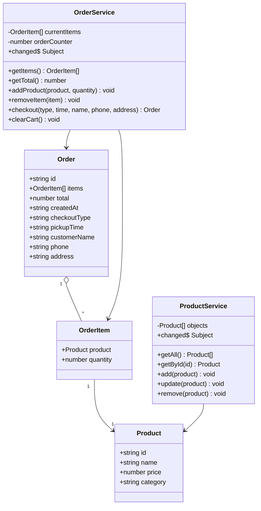
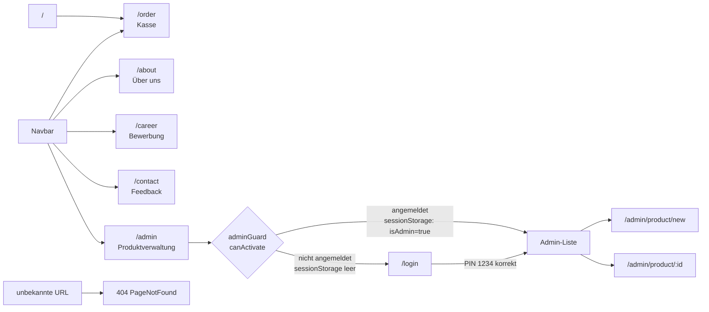
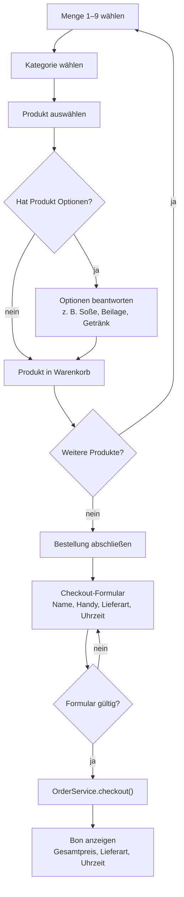
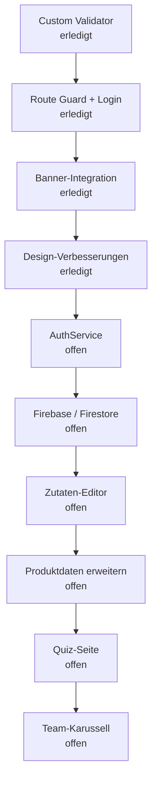

# McDenisa Wiki

Dieses Dokument sammelt, was im Angular/WebFrontends-Projekt umgesetzt wurde, welche Probleme aufgetreten sind und was noch offen ist. Orientierung: Kursbuch `docs/webfrontends-buch.pdf` und Projektregeln `docs/projekt-vorgaben.md`.

---

## Schon gemacht

### Grundstruktur

- Angular-Projekt mit Standalone-Components aufgebaut.
- Routing eingerichtet:
  - `/order` — Kassenseite
  - `/about` — Über uns
  - `/career` — Bewerbung
  - `/contact` — Kontakt / Feedback
  - `/login` — Admin-Login
  - `/admin` — Produktverwaltung (geschützt)
  - `/admin/product/new` — Neues Produkt (geschützt)
  - `/admin/product/:id` — Produkt bearbeiten (geschützt)
  - Wildcard-Route für 404-Seite.
- Navbar mit `routerLink` und `routerLinkActive`.
- Navbar ist sticky (`position: sticky; top: 0; z-index: 100`).
- Schriftart: Nunito (Google Fonts), eingebunden in `index.html`.

### Modelle

- `src/app/model/product.ts` — Produktmodell
- `src/app/model/order.ts` — Bestellmodell mit Kundendaten, Lieferart und Uhrzeit
- `src/app/model/order-item.ts` — Bestellposition mit Produkt und Menge

### Services (Kap. 8.5–8.6)

- `ProductService` (`src/app/shared/product.ts`) — verwaltet alle Produkte, sendet Änderungen über `changed$` als RxJS-Subject.
- `OrderService` (`src/app/shared/order.ts`) — verwaltet Warenkorb und abgeschlossene Bestellungen.

### Kassenseite

- Kategorien mit Bildern (Menüs, Happy Meal, Burger, Chicken, Beilagen, Getränke, McCafé, Desserts).
- Mengenauswahl 1 bis 9 vor dem Hinzufügen.
- Akkordeon-Dialog: Produkt wählen → Optionen beantworten (z. B. Soße, Getränk, Größe).
- Warenkorb links: Artikel, Menge, Preis, Entfernen-Button.
- Checkout-Formular als modales Fenster:
  - Name, Handynummer
  - Lieferart (Abholen / Liefern)
  - Uhrzeit
  - Lieferadresse (nur bei Liefern Pflicht)
- Bon wird nach Bestellabschluss angezeigt.
- Banner (`mcdenisa-banner-wide.png`) ist als `order-hero` innerhalb des rechten Content-Bereichs platziert — nicht über dem Warenkorb.

### Admin-Bereich

- Produkte anzeigen, anlegen, bearbeiten, löschen.
- Produktformular mit Reactive Forms und Validierung.

### Route Guard (Kap. 10.2)

Datei: `src/app/shared/admin.guard.ts`

```typescript
export const adminGuard: CanActivateFn = () => {
  const router = inject(Router);
  if (sessionStorage.getItem('isAdmin') === 'true') {
    return true;
  }
  return router.createUrlTree(['/login']);
};
```

- `CanActivateFn` — funktionaler Guard (Angular 14+, Buchstil Kap. 10.2).
- `inject()` für Router — kein Konstruktor nötig.
- Schützt `/admin`, `/admin/product/new`, `/admin/product/:id`.
- Bei fehlendem Login: Weiterleitung zu `/login` über `router.createUrlTree`.
- Login-Status wird in `sessionStorage` gespeichert (bleibt beim Reload erhalten).

### Login-Seite

Datei: `src/app/login/login.ts`

- Reactive Form mit einem `pin`-Feld.
- PIN: `1234`.
- Bei richtigem PIN: setzt `sessionStorage.setItem('isAdmin', 'true')` und navigiert zu `/admin`.
- Bei falschem PIN: zeigt Fehlermeldung, setzt das Formular zurück.

### Custom Validator (Kap. 11.4)

Datei: `src/app/shared/validators.ts`

```typescript
export function phoneValidator(control: AbstractControl): ValidationErrors | null {
  if (!control.value) return null;
  return /^[+\d\s\-()]+$/.test(control.value) ? null : { invalidPhone: true };
}
```

- Einfache Validator-Funktion (kein Service nötig).
- Wird im Bewerbungsformular auf das `phone`-Feld angewendet.
- Erlaubt: Ziffern, `+`, Leerzeichen, `-`, Klammern.
- Bei Verstoß: `{ invalidPhone: true }` — zeigt Fehlermeldung im Template.

### Reactive Forms (Kap. 11)

Eingesetzt bei:
- Produktformular (Admin)
- Login
- Kontaktformular
- Bewerbungsformular

Bewerbungsformular (`career.ts`) hat folgende Felder:
- `name` — Pflicht, min. 2 Zeichen
- `email` — Pflicht, E-Mail-Format
- `phone` — optional, Custom Validator `phoneValidator`
- `area` — Pflicht, Dropdown: Küche / vorne / egal
- `availableFrom` — Pflicht, Datum
- `message` — optional

### Banner

- Bild: `public/assets/menu/mcdenisa-banner-wide.png` — 2172×240 px (Verhältnis ~9:1), minimalistisches Design.
- Inhalt: „McDenisa | Lecker. Schnell. Einfach." links, Essens-Icons rechts (Burger, Pommes, Cola, Kaffee, Eis), cremefarbener Hintergrund.
- Auf der Kassenseite: Banner als `order-hero` in `pos-content` (rechts neben dem Warenkorb), Höhe 150 px, `border-radius: 14px`.
- Auf allen anderen Seiten: Banner global in `app.html` mit `@if (showBanner)`, Höhe 150 px, volle Breite.
- `showBanner`-Getter in `app.ts` gibt `false` zurück wenn die URL mit `/order` beginnt.

**Verlauf der Banner-Datei:**
1. `mcdenisa-banner.png` — Original 2172×724 (3:1), zu hoch für Website-Banner.
2. `mcdenisa-banner-wide.png` (erste Version) — per `sips` auf 2172×360 (6:1) aus dem Original zugeschnitten.
3. `mcdenisa-banner-wide.png` (aktuelle Version) — neues, minimalistisches Design (erstellt mit KI-Bildgenerator), original 2172×724, Inhalt als schmaler Streifen vertikal zentriert. Per `sips` auf 2172×240 zugeschnitten (`--cropOffset 240 0`), sodass nur der Inhaltsstreifen ohne Whitespace sichtbar ist.

### Footer

Datei: `src/app/footer/`

- Globale Fußzeile, eingebunden in `app.html` unter `<router-outlet>` — erscheint auf allen Seiten beim Scrollen.
- Vier Spalten:
  - **McDenisa** — Adresse (Oststraße 12, 59227 Ahlen), Telefon, E-Mail
  - **Öffnungszeiten** — Mo–Fr, Sa–So, Feiertage
  - **Navigation** — Links zu Bestellen, Über uns, Karriere, Kontakt
  - **Rechtliches** — Impressum, Datenschutz, AGB + Schulprojekt-Hinweis
- Untere Zeile: Copyright `© {{ year }} McDenisa Ahlen` (Jahr dynamisch per `new Date().getFullYear()`) + Markenhinweis.
- Design: dunkler Hintergrund (`#2a0a0a`), cremefarbener Text, Gold-Hover auf Links.

### Design-Details

- Schriftart: `Nunito` (Google Fonts), Fallback: `Segoe UI`.
- Farbpalette:
  - `--mc-maroon: #800000` (Navbar, Cart-Header, aktive Buttons)
  - `--mc-brown: #8B4513`
  - `--mc-white: #ffffff`
  - Hintergrund: `#FAEBD7` (AntiqueWhite)
- Warenkorb-Sidebar: `background: #fffaf2`, `border-right: 1px solid #ead8bd`.
- Leerer Warenkorb: styled mit `.cart-empty-state` (cremefarbener Hintergrund, Icon, Text).
- Mengen-Buttons: 42×42 px, `border-radius: 10px`, Hover- und `:active`-Effekte.
- Kategorie-Karten: `height: 172px`, Hover (`translateY(-3px)`), Klick-Effekt (`scale(0.96)`).

---

## Probleme und Lösungen

### Banner-Format falsch (3:1 statt 6:1 oder schmaler)

**Problem:** Das ursprüngliche Banner-Bild hatte das Format 2172×724 (Verhältnis ~3:1). Für einen flachen Website-Banner werden 6:1 oder schmaler benötigt. Bei niedriger Displayhöhe war das Bild abgeschnitten, bei vollständiger Anzeige zu hoch.

**Lösung:** Zuerst per `sips` auf 2172×360 zugeschnitten. Danach durch ein neu erstelltes, minimalistisches Banner (KI-generiert) ersetzt, das auf 2172×240 zugeschnitten wurde. Der sichtbare Streifen zeigt nun das gesamte Motiv ohne Crop.

### Banner erschien dreifach

**Problem:** Das Banner `mcdenisa-banner.png` war an drei Stellen gleichzeitig eingebunden:
1. Als Bild in der Navbar-Brand.
2. Global in `app.html` als `<div class="site-banner">`.
3. Als `order-hero`-Div in `order.html`.

Außerdem waren zwei davon sichtbar gleichzeitig auf der Kassenseite, was unruhig und unprofessionell wirkte.

**Lösung:**
- Navbar-Brand: zurück auf reinen Text `McDenisa`.
- `order-hero` in `order.html` bleibt, aber innerhalb von `pos-content` (rechts neben dem Warenkorb — nicht darüber).
- Globaler Banner in `app.html` wird nur angezeigt, wenn die Route **nicht** `/order` ist (`@if (showBanner)`).

### Banner war zu hoch (falsche Proportionen)

**Problem:** Das originale Banner-Bild (`mcdenisa-banner.png`) hatte das Format 2172×724 px (Verhältnis ~3:1). Für ein flaches Website-Banner braucht man ~6:1. Dadurch war das Bild bei niedriger Displayhöhe abgeschnitten, oder bei vollständiger Anzeige zu hoch.

**Lösung:** Das Bild wurde per `sips` (macOS-Bordwerkzeug) zugeschnitten:

```bash
sips -c 360 2172 --cropOffset 90 0 mcdenisa-banner.png --out mcdenisa-banner-wide.png
```

- Neues Format: 2172×360 px (Verhältnis 6:1).
- Startpunkt y=90 — überspringt den dekorativen Blob oben, behält Krone, Text und Essensbilder.
- Gespeichert als separates Bild (`mcdenisa-banner-wide.png`), Original bleibt erhalten.

### „McDenisa" Navbar-Text war schwarz

**Problem:** Bootstrap setzt `.navbar-brand` standardmäßig auf `color: rgba(0,0,0,0.9)`. Unsere `.navbar-mc`-Klasse überschrieb das nicht.

**Lösung:**

```css
.navbar-mc .navbar-brand {
  color: #fff !important;
}
```

### POS-Layout-Höhe nach Banner-Integration

**Problem:** Nach Einfügen des globalen Banners wurde die POS-Höhe falsch berechnet — entweder zu klein oder das Layout ragte über den Viewport hinaus.

**Lösung:** Da der globale Banner auf der Kassenseite ausgeblendet wird (`showBanner = false`), gilt auf `/order` weiterhin die einfache Berechnung:

```css
.pos-layout {
  height: calc(100vh - 62px);
}
```

---

## Noch zu tun

### 1. Firebase / Firestore (Kap. 12)

Status: offen

Ziel:
- Produkte in Firestore speichern statt im lokalen `ProductService`.
- CRUD-Operationen über Firestore.
- Erfordert: Firebase-Projekt anlegen, `@angular/fire` installieren, Firestore konfigurieren.

Voraussetzung: Firebase-Projekt muss vom Entwickler selbst angelegt werden (Console: console.firebase.google.com).

### 2. AuthService (Kap. 10.3)

Status: teilweise — Guard funktioniert, aber ohne eigene Service-Klasse.

Ziel (laut Buch):
- `AuthService` mit `isLoggedIn()`, `login()`, `logout()`.
- Guard nutzt `inject(AuthService)` statt direkt `sessionStorage`.
- Login-Komponente nutzt `AuthService.login()`.
- Logout-Button in der Navbar sichtbar wenn angemeldet.

### 3. Team-Karussell auf Über-uns-Seite

Status: offen

Ziel:
- Auf `/about` ein Karussell mit Team-Karten.
- Vorderseite: Avatar, Name, Rolle.
- Rückseite: Lieblingsprodukt, Motto, wie lange dabei.
- Flip-Animation beim Klick.

### 4. Quiz-Seite

Status: offen

Ziel:
- Neue Route `/quiz`.
- Fragen zu Produkten, Menüs, Preisen.
- Ergebnisseite mit Auswertung.
- Name-Eingabe per Reactive Form vor dem Quiz.

### 5. Zutaten-Editor

Status: offen

Ziel:
- Beim Produktklick: Zutatenliste mit Häkchen (wie in Avalonia-Version).
- Entfernte Zutaten werden in der Bestellung und im Bon angezeigt.

### 6. Produktdaten erweitern

Status: offen

Ziel:
- Pro Produkt: Allergene, Kalorien.
- Anzeige in Produktdetails oder Admin-Bereich.

---

## Diagramme

### UML-Klassendiagramm



### Routing-Übersicht



### Bestellablauf



### Arbeitsreihenfolge



---

## Technische Pflichtaufgaben laut Kursbuch

| Aufgabe | Kap. | Status |
|---|---|---|
| Components, Templates, @for, Pipes | 6–7 | erledigt |
| Datenmodell (TypeScript-Klassen) | 8.3 | erledigt |
| Services + Dependency Injection | 8.5–8.6 | erledigt |
| Routing + RouterLink + RouterOutlet | 9 | erledigt |
| Navbar mit routerLinkActive | 9.5 | erledigt |
| Reactive Forms | 11 | erledigt |
| Custom Validator | 11.4 | erledigt |
| Route Guard (CanActivateFn) | 10.2 | erledigt |
| AuthService-Muster | 10.3 | teilweise |
| Firebase / Firestore | 12 | offen |
